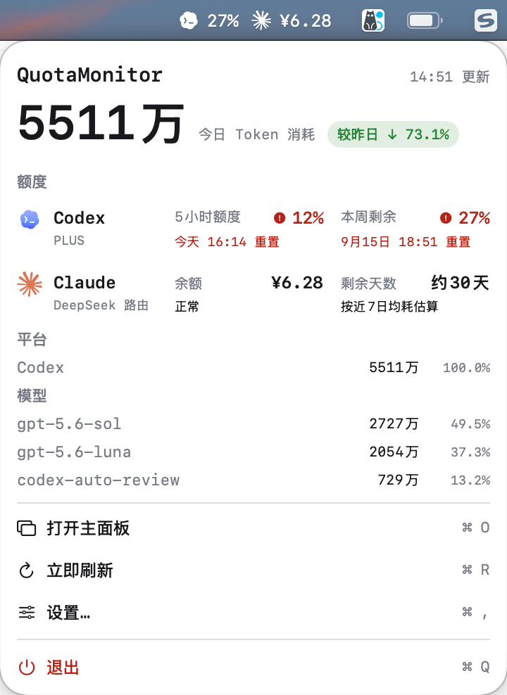
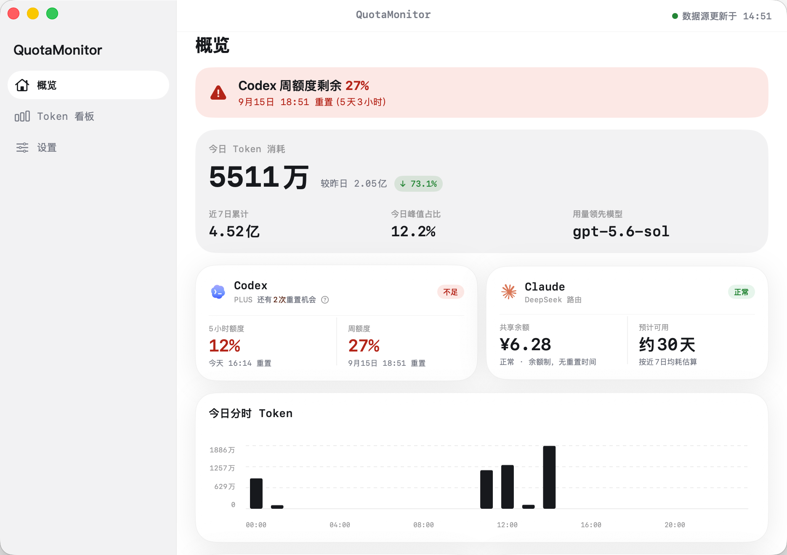
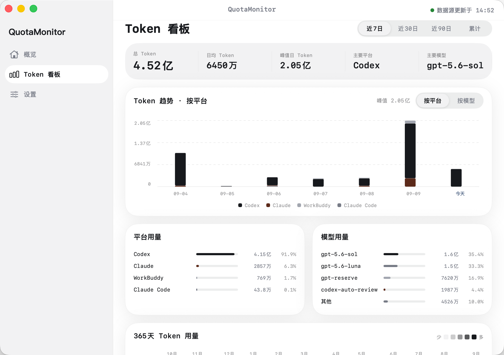
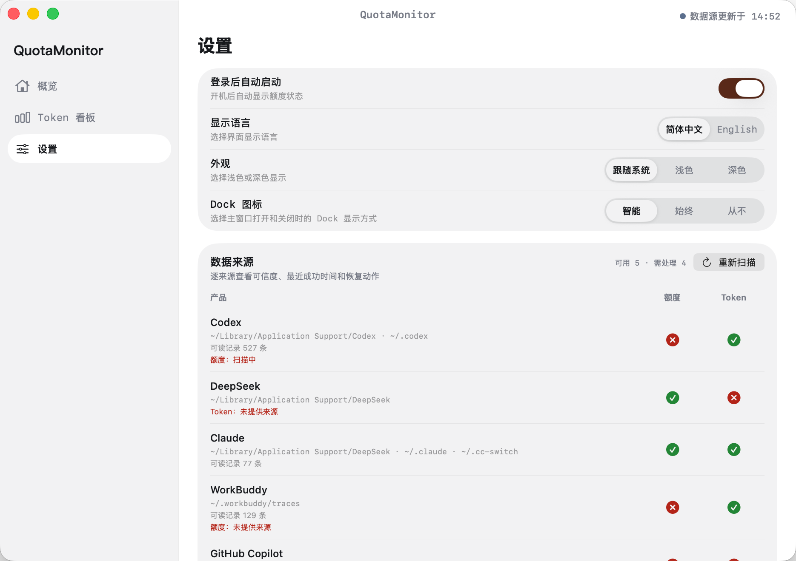
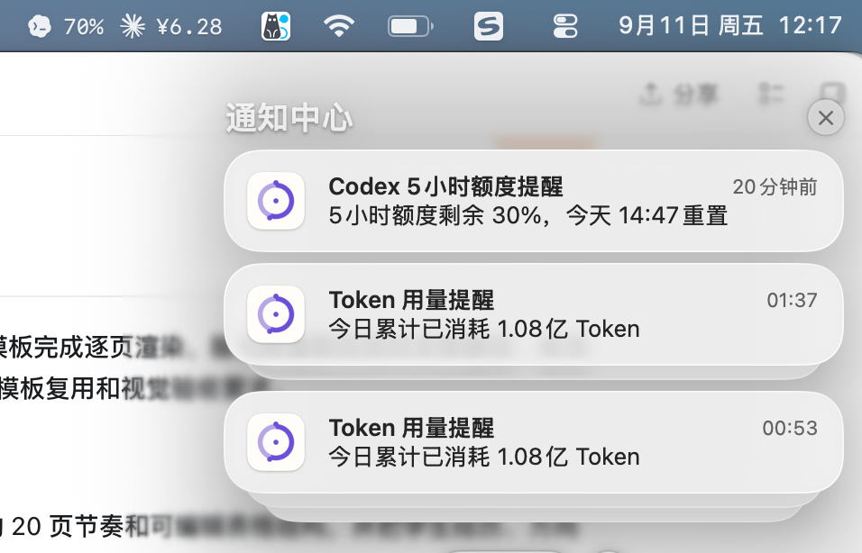
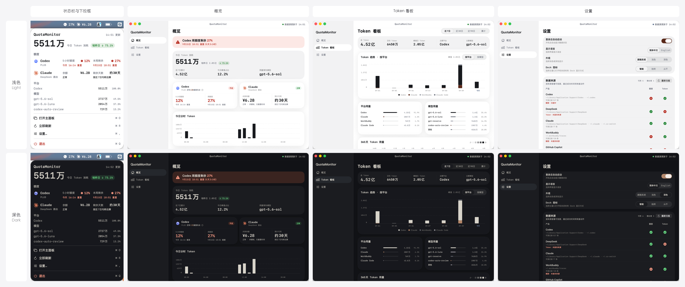

<p align="center">
  
</p>

<h1 align="center">QuotaMonitor</h1>

<p align="center">同时用 Codex、Claude、WorkBuddy 写代码，却总在切窗口查额度？<br>QuotaMonitor 把 Codex 剩余额度、DeepSeek 余额和 20+ AI 工具的本地 Token 消耗，集中到 Mac 菜单栏——抬眼就能看，点击查详情。</p>

<p align="center">
  <strong>📍 菜单栏常驻</strong> · 不用切窗口，抬眼看 Codex 周额度和 DeepSeek 余额<br>
  <strong>🔔 到线提醒</strong> · 额度接近风险线、DeepSeek 余额偏低或 Token 跨过里程碑时及时通知<br>
  <strong>🔒 纯本地运行</strong> · 用量在本机解析，不上传对话、不需要注册账号<br>
  <strong>📊 多工具统一视图</strong> · Codex、Claude、WorkBuddy、Qoder、Kimi 等 Token 趋势和用量分布，一个看板看完
</p>

<p align="center">
  <a href="#开始使用">快速上手</a> ·
  <a href="docs/INSTALL.md">安装与排查</a> ·
  <a href="docs/DATA_SOURCES.md">工具支持清单</a> ·
  <a href="docs/REMINDER_PRODUCT_DESIGN.md">提醒机制方案</a> ·
  <a href="PRIVACY.md">隐私说明</a> ·
  <a href="https://github.com/haohaozhang905-code/QuotaMonitor/issues">反馈问题</a>
</p>

<p align="center">
  
  
  
</p>

## 从状态栏，到提醒与完整看板

**抬眼看状态，及时接收提醒，点击查详情，需要时再展开分析。** QuotaMonitor 提供四种形态，让额度、余额和 Token 用量各有合适的查看入口。

| 形态 | 什么时候用 | 能看到什么 |
| --- | --- | --- |
| **① 状态栏** | 工作时抬眼查看 | Codex 周额度、已识别 DeepSeek 路由的余额 |
| **② 下拉框** | 点击菜单栏入口，快速确认 | 今日 Token、较昨日变化、5 小时 / 周额度、重置时间及用量摘要 |
| **③ 主面板** | 想了解风险、趋势与来源状态 | 风险优先概览、Token 看板、数据来源诊断与显示设置 |
| **④ 提醒通知** | 额度触达风险线或 Token 跨过里程碑 | macOS 原生通知，或菜单栏下方的应用内提醒卡片；多项分别显示 |

以下展示均为真实运行截图；页面会跟随 GitHub 的浅色或深色主题自动切换。截图中的额度、余额、Token 数量和时间只代表拍摄当时的账户与本机记录。

### ① 状态栏 → ② 下拉框

状态栏保留最需要随时看到的两个数字；点击后展开下拉框，在不打开主窗口的情况下查看额度、重置时间、今日 Token，以及平台和模型摘要。

<picture>
  <source media="(prefers-color-scheme: dark)" srcset="docs/images/menu-dropdown-dark.png">
  <source media="(prefers-color-scheme: light)" srcset="docs/images/menu-dropdown-light.png">
  
</picture>

### ③ 主面板：先看风险，再看当日概览

概览页把当前最需要关注的额度放在顶部，同时展示今日 Token、较昨日变化、Codex 重置卡、额度窗口、共享余额和今日分时趋势。

<picture>
  <source media="(prefers-color-scheme: dark)" srcset="docs/images/overview-dark.png">
  <source media="(prefers-color-scheme: light)" srcset="docs/images/overview-light.png">
  
</picture>

### Token 看板：看趋势，也看用量分布

选择近 **7 / 30 / 90 日或累计**范围，按平台或模型查看 Token 趋势；结合用量排行和 **365 天热力图**，回看哪些工具用得多、哪段时间用得集中。

<picture>
  <source media="(prefers-color-scheme: dark)" srcset="docs/images/token-dashboard-dark.png">
  <source media="(prefers-color-scheme: light)" srcset="docs/images/token-dashboard-light.png">
  
</picture>

### 设置：确认启动行为和数据来源

设置页集中管理登录后启动、界面语言、浅色 / 深色外观和 Dock 图标策略；数据来源区逐项显示额度与 Token 是否可读，以及需要处理的原因。

<picture>
  <source media="(prefers-color-scheme: dark)" srcset="docs/images/settings-dark.png">
  <source media="(prefers-color-scheme: light)" srcset="docs/images/settings-light.png">
  
</picture>

### ④ 提醒通知：额度到线，Token 跨过里程碑

QuotaMonitor 会在 Codex 5 小时 / 周额度剩余不超过 30%、DeepSeek 余额低于 ¥5，或本机当天 Token 用量达到每个 1 亿里程碑时提醒。系统通知已获 macOS 授权时使用原生通知；没有授权或投递失败时，自动回退到菜单栏下方的应用内卡片。同一轮同时触发多个事项时，每个事项分别通知，不合并成一条。



<details>
<summary>浅色 / 深色完整截图一览</summary>



</details>

## 它能帮你做什么

如果你经常在 Codex、Claude Code、WorkBuddy 等 AI 工具之间切换，可以用 QuotaMonitor 回答三个问题：

- **额度还剩多少？** 查看 Codex 5 小时 / 周额度及重置时间；使用已识别的 DeepSeek 路由时查看共享账户余额。
- **最近用了多少？** 按今日、近 7 / 30 / 90 日或累计范围查看本机 Token 总量和趋势。
- **主要用在哪？** 在"按平台"和"按模型"之间切换，查看工具与模型的使用分布。
- **需要提醒吗？** 额度、DeepSeek 余额和 Token 里程碑各自触发提醒；系统通知不可用时仍显示应用内提醒。

应用运行在 macOS 菜单栏中，无需额外注册 QuotaMonitor 账号。代码按 MIT 协议开放；你使用的 AI 服务和协助安装的 Agent 可能有各自的费用。

**适用环境：macOS 14+，Apple silicon 或 Intel Mac。** 当前没有 Windows、Linux、iOS 或 Android 客户端；Mac 上的可用数据取决于对应工具实际生成的记录。

## 支持哪些 AI 工具

当前能查询的远端额度 / 余额为 **Codex 和 DeepSeek**；本地 Token 统计代码覆盖 **23 个平台标识**，包括 Codex、Claude Code、Claude Desktop（经 cc-switch）、WorkBuddy、Qoder、Kimi Desktop 等专用解析，以及 OpenCode、Cline、Grok Build、GitHub Copilot、Zed 等通用目录适配。

> "支持"表示代码已接入相应入口，不代表所有工具版本都完成真实环境验证，也不代表安装工具后一定已经产生可读日志。Token 统计只覆盖本机实际存在、且包含明确用量字段的日志或数据库记录。

完整的平台 × 数据采集矩阵、路径、环境变量、统计口径与验证边界，见 **[工具支持清单](docs/DATA_SOURCES.md)**。

TraeWork、千问办公和豆包工作当前不纳入采集，原因见工具支持清单中的覆盖边界说明。

## 开始使用

1. **启动 QuotaMonitor。** 在 Mac 顶部菜单栏找到入口，点击查看下拉面板，再进入主面板。
2. **按需要准备数据源。** 查询 Codex 额度需先在同一 macOS 用户下登录 Codex；统计其他工具的本地 Token 不要求先购买或登录 Codex。DeepSeek 余额需要当前已配置的 Codex / Claude / cc-switch DeepSeek 路由和可读取凭据。
3. **查看"概览"。** 顶部警示优先显示当前最需要关注的额度；下方可确认重置时间、路由、共享余额和 Codex 重置卡。重置卡只展示接口返回的可用数量与到期时间，不会自动兑换。
4. **打开"Token 看板"。** 选择时间范围，切换平台或模型查看趋势与排行。首次使用会扫描已有日志；已有缓存时先显示缓存，再后台更新。
5. **按需调整设置。** 支持简体中文 / English、跟随系统 / 浅色 / 深色外观、登录后自动启动、Dock 图标策略、额度与用量提醒和数据源重新扫描。新安装默认开启额度与用量提醒及系统通知偏好；如果 macOS 没有授权系统通知，会自动使用应用内提醒。额度约每 60 秒刷新，本地 Token 约每 5 分钟刷新；文件变化还会触发合并后的更新，界面并非逐请求实时流。提醒的阈值、去重和通知降级规则见[提醒机制方案](docs/REMINDER_PRODUCT_DESIGN.md)。

额度、余额与本地 Token 是不同指标。Token 数量不能直接换算为订阅剩余额度或实际账单金额。

## 使用前，你可能关心这些

| 顾虑 | 当前已做的处理 | 仍需了解 |
| --- | --- | --- |
| 会不会耗电、拖慢 Mac？ | 使用持久化缓存、变化文件复用、可续读日志的增量解析、合并文件事件、单实例保护和菜单栏按状态重绘；已移除历史高耗电的无限脉冲动画 | 首次扫描、大文件改写和持续生成日志仍会占用 CPU、磁盘与内存；没有跨机型长期续航数据，不承诺"零耗电"。持续异常请按安装指南排查 |
| 会不会泄露聊天或 API Key？ | 用量在本机解析，不把对话正文保存到统计缓存或上传；没有项目自建的账号、广告或遥测后端 | 解析器会读取可能含正文的日志；认证信息会用于向对应服务商发起查询。缓存含路径、模型及部分去重标识，不属于匿名数据；本项目未宣称通过独立安全审计 |
| 会消耗我的模型 Token 吗？ | 应用采集本地记录、查询额度或余额，不向模型提交生成任务 | 网络查询仍存在；AI 服务及安装时所用 Agent 的收费由各自提供方决定 |
| 会修改聊天记录、自动切换路由吗？ | 本地采集读取源日志，数据库使用只读查询；应用保存自身缓存与偏好，不自动修改工具路由或兑换额度 | Codex 官方 app-server 回退由 Codex 自己管理认证；启用登录后自动启动会新增相应系统登录项 |
| 为什么和官方账单不一样？ | 按来源处理缓存 Token、模型归一化及已知重复记录 | 只覆盖本机可读日志，不包含其他设备和未落盘请求；订阅额度规则、计费口径与 Token 总量也不同 |
| 没联网还能看吗？ | 本地日志和已有统计缓存可用于查看用量 | Codex 额度、DeepSeek 余额无法离线更新；失败后可能保留旧结果，请留意更新时间 |
| 必须给所有文件权限吗？ | 应用按定义的数据目录读取，不要求把凭据复制到聊天中 | 为读取其他工具目录，当前应用未启用 App Sandbox；文件与钥匙串访问仍受 macOS 权限控制。不要为排障盲目开启全部权限 |
| 换账号或删除日志会怎样？ | 额度根据当前可读取的认证和路由更新；可保留上一份有效统计以抵御临时读取失败 | 本地历史没有完整的多账号隔离，也不是永久备份；删除源日志后重扫可能改变总量。旧缓存不应被当作当前账号账单 |
| 提醒会不会连续打扰？ | 同一风险周期只提醒一次；同一轮多个事项分别显示，应用内卡片默认 8 秒自动消失，悬停可暂停 | macOS 原生通知的停留、声音和通知中心保留由系统设置决定；应用内提醒是无权限时的回退渠道 |

详细数据流与凭据用途见 [隐私说明](PRIVACY.md)，启动失败、空数据和持续高占用的处理见 [安装指南](docs/INSTALL.md)。

## 如何安装

截至 **2026-09-10**，本仓库尚未发布可下载的 Release 安装包，当前可从源码构建（约 2 分钟）。后续安装包以 [GitHub Releases](https://github.com/haohaozhang905-code/QuotaMonitor/releases) 中实际提供的附件为准，源码 ZIP 不等同于可直接安装的应用。

### 交给你的编程 Agent

在具有本机终端和文件操作能力的 Agent 中复制下面这段话，例如你正在使用的 Codex 或 Claude Code：

> 请帮我在这台 Mac 上安装 QuotaMonitor：https://github.com/haohaozhang905-code/QuotaMonitor 。先阅读 README.md 和 docs/INSTALL.md，检查 macOS、Swift 工具链及是否已有安装。若 Releases 有适配的正式安装包，核实来源和签名状态后安装；没有安装包则按仓库指引从源码构建，使用本地 ad-hoc 签名，无需购买开发者证书。安装完成后确认应用能启动、菜单栏入口可见，并告诉我哪些数据源已可用、哪些还需要配置。涉及系统授权或替换已有版本时先说明影响；保留已有源码改动，不要打印或上传凭据、API Key 和完整对话日志，也不要关闭系统安全保护。

普通网页聊天窗口无法直接完成本机安装。Agent 可能需要你批准工具链下载、安装目录写入或系统权限；初次编译也需要等待。

自行操作、更新或卸载，请看 **[完整安装与排查指南](docs/INSTALL.md)**。

## 想自己魔改？

QuotaMonitor 按 **MIT 协议**开放，拿到源码后随便改——不用问，不用报备，改完自己用或者再分发都行。常见的魔改方向：

- **加一个没覆盖的 AI 工具**：在 `Models/TokenUsageDimensions.swift` 注册平台标识，在 `Services/AdditionalLocalTokenClient.swift` 加目录适配；特殊格式另建专用 client。
- **改视觉**：配色、字体、图表布局在 `Views/PanelTheme.swift`、`Views/MainPanelView.swift`、`Views/DropdownViews.swift` 里调，深浅色一起改。
- **加功能**：扩展提醒规则、CSV 导出、预算告警、自定义供应商余额接口——都有明确的代码入口和验收要点。
- **接入其他服务商余额**：参考 `Services/DeepSeekBalanceClient.swift` 的实现模式。

**不会写 Swift 也没关系**——把需求丢给你的编程 Agent（Codex、Claude Code 等），它能帮你读代码、改代码、跑测试。[定制与二次开发指南](docs/CUSTOMIZATION.md)里准备了三个可直接复制给 Agent 的需求模板（新增工具、改界面、扩展提醒），以及推荐的修改流程和验收清单。

改出了有意思的东西？欢迎提 PR 回馈社区，或者自己 fork 了玩。

## 开发与贡献

项目使用 Swift 6、Swift Package Manager、SwiftUI 和 AppKit。

```bash
swift test
./script/security_check.sh
```

本地构建、安装到"应用程序"并启动验证：

```bash
QUOTAMONITOR_ALLOW_ADHOC=1 QUOTAMONITOR_SIGNING_IDENTITY=- ./script/build_and_run.sh --verify
```

该命令会替换已有的 QuotaMonitor 应用；有本地修改时先阅读[安装指南](docs/INSTALL.md)。公开发行需按[发布指南](docs/RELEASING.md)完成正式签名和公证。

| 目录 | 内容 |
| --- | --- |
| `Sources/QuotaMonitor/App`、`Views` | 应用入口、菜单栏、主面板 |
| `Sources/QuotaMonitor/Services` | 额度接口、本地日志和数据库解析 |
| `Sources/QuotaMonitor/Models`、`Stores` | 数据口径、聚合、缓存与刷新 |
| `Sources/QuotaMonitor/Support`、`Resources` | 公共工具、图标和中英文本地化 |
| `Tests/QuotaMonitorTests` | 解析、模型与交互规则测试 |

欢迎提交 [Issue](https://github.com/haohaozhang905-code/QuotaMonitor/issues) 或 Pull Request。说明应用版本 / 提交号、macOS 与工具版本、预期行为、实际结果和复现步骤；分享截图或样例前去除凭据与对话正文。安全问题请走 [SECURITY.md](SECURITY.md) 中的私密渠道。

当前不足与可改造方向见 **[路线图](docs/ROADMAP.md)**。贡献规范见 [CONTRIBUTING.md](CONTRIBUTING.md)。本项目为独立工具，与所列 AI 服务商无隶属关系。

## License

[MIT](LICENSE) © 2026 QuotaMonitor Contributors
