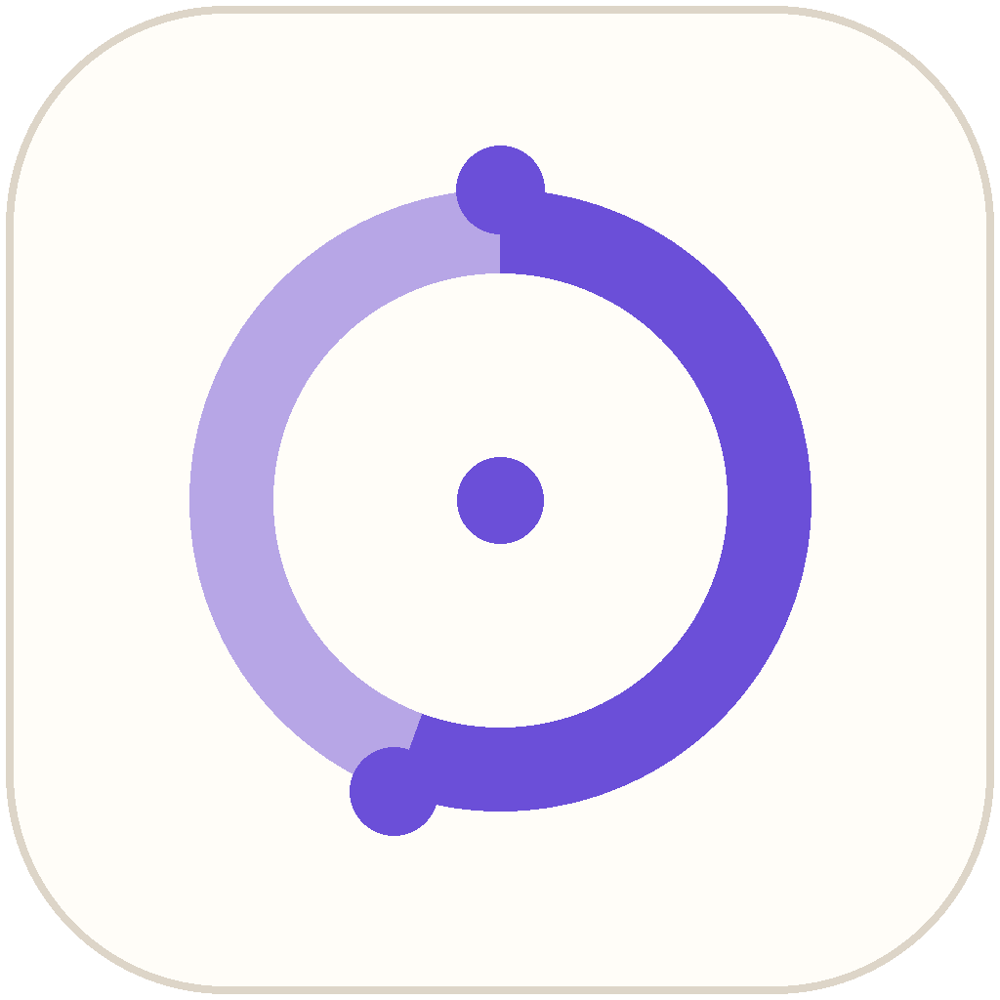

<p align="center">
  
</p>

<h1 align="center">QuotaMonitor</h1>

<p align="center">A native macOS menu-bar dashboard for quota, balance, and local AI token usage.</p>

## What it does

- Shows official Codex session/weekly quota, reset time, and reset credits in the menu bar and main panel.
- Detects Codex and Claude routes independently. When either route uses DeepSeek, it shows the shared DeepSeek balance and estimates its remaining days.
- The main panel is split into two tasks: **Quota monitor** for remaining quota and reset times, and **Token dashboard** for usage by today, the last 7 days, or the last 30 days.
- Token dashboard data can be viewed by platform or by the actual model name. A Claude request routed through DeepSeek remains Claude in the platform view and DeepSeek in the model/provider view.
- Reads local token usage from dedicated Codex, Claude Code, Claude Desktop (through cc-switch), and WorkBuddy parsers, plus a data-driven catalog of additional AI tools. Model-level buckets are retained for trend and ranking views.
- Uses the current Codex Keychain credential store when available, while retaining compatibility with legacy `auth.json` installations.
- Has no dashboard server, account system, analytics, or telemetry backend.

## Supported sources

| Source | What QuotaMonitor reads | Notes |
| --- | --- | --- |
| Codex | Official quota endpoint and local session logs | New Codex versions store login credentials in the macOS Keychain; older file-based credentials are still supported. |
| Claude Code | Local project transcripts | Token usage only; Anthropic official quota is not currently available. |
| Claude Desktop | cc-switch request-log database | cc-switch is the available source for this usage. When it is not running, the desktop column is marked as not captured. |
| WorkBuddy | Trace summary and generation usage fields | Older traces are read from their compact header. Newer traces are streamed locally to locate structured usage metadata; prompt and response content is not retained, displayed, or transmitted. |
| DeepSeek | Official balance endpoint | Uses the active Codex or Claude/cc-switch DeepSeek credential and treats the balance as a shared pool. |

### Additional local usage sources

QuotaMonitor also automatically discovers structured token records in local JSON, JSONL, and SQLite data for the following tools: OpenCode, Hermes Agent, OpenClaw, Cursor (when its sync cache is present), Antigravity, Cline, Kimi CLI / Kimi Code / Kimi Desktop, Qwen CLI, Grok Build, GitHub Copilot, Pi / Oh My Pi, Zed, Kilo Code, MiMo Code, ZCode / GLM, Kiro, CodeBuddy, Proma, Reasonix, and Qoder.

Each source has a narrow default path, an mtime-and-size cache, and its own platform bucket. Adding a future tool normally means adding one `LocalToolTokenSource` entry rather than rewriting the dashboard. If a tool stores its data outside the default location, set its documented `QUOTAMONITOR_<TOOL>_HOME` override (for example, `QUOTAMONITOR_OPENCLAW_HOME`); the existing `HERMES_HOME`, `KIMI_CODE_HOME`, `GROK_HOME`, and `REASONIX_HOME` variables are also honored.

The catalog collects only records that carry explicit token fields. Qoder's local event and desktop transcript records are deduplicated by their stable request/message IDs. Cursor's ordinary transcript text is intentionally not treated as usage, because it can contain JSON pasted into a chat; it becomes available when Cursor's structured sync cache is present. Services whose upstream project currently exposes an account limit or balance API but no local token log—such as OpenRouter, Minimax, Volcengine, Qoder account credits, Ollama, and custom compatible endpoints—remain separate from local usage collection until their credentials and response contracts are configured.

## How the numbers are calculated

- **Token total:** input tokens plus output tokens. Cache hits, cache writes, and reasoning tokens remain available as details, rather than being counted again.
- **DeepSeek usage:** requests whose recorded model name contains `deepseek`.
- **Estimated remaining days:** DeepSeek balance divided by the average estimated DeepSeek cost across the latest seven calendar days, capped at 30 days. This is an estimate, because model selection and cache behavior affect actual billing.

## Installation

When a notarized build is published, download `QuotaMonitor-x.y.z.dmg` from [GitHub Releases](https://github.com/haohaozhang905-code/QuotaMonitor/releases), drag QuotaMonitor to Applications, then launch it after signing in to Codex. If you use DeepSeek through Claude, keep the active provider configured in Claude or cc-switch so its balance credential can be read locally.

## Privacy

QuotaMonitor reads local authentication credentials and usage records only to fetch quota/balance and calculate local usage. It sends requests directly to OpenAI or DeepSeek. It has no analytics, account system, location access, or telemetry backend. See [PRIVACY.md](PRIVACY.md).

## Local development

Requirements: macOS 14+, Xcode Command Line Tools, and Swift 6. The release build is universal for Apple silicon and Intel Macs.

```bash
swift test
./script/build_and_run.sh --verify
```

To build a local release package, run `./script/package_release.sh --unsigned`. For a public release, use a Developer ID Application certificate and Apple notarization as documented in [docs/RELEASING.md](docs/RELEASING.md).

## License

[MIT](LICENSE) © 2026 QuotaMonitor Contributors
